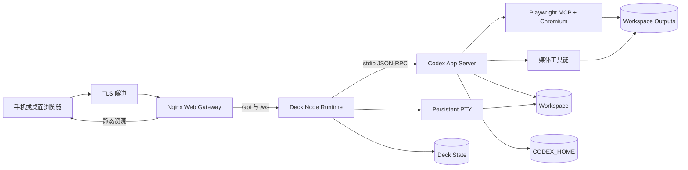

# Sim Desk 容器架构

状态：已接受的架构基线  
日期：2026-07-26

## 1. 结论

Sim Desk 采用纯容器工作环境：Ubuntu runtime 是 Codex 实际读取文件、执行命令、运行浏览器和生成媒体的地方。宿主系统可以是 Linux、Windows、macOS、NAS 或云服务器，不参与 Codex 的执行语义，只负责：

- 运行 Docker Compose；
- 把选定目录挂载为容器工作区；
- 持久化 Codex 状态和生成物；
- 提供到 Nginx HTTP 入口的网络；TLS 可以由外部隧道或反向代理终止。

因此，不需要为了保留宿主 Shell、宿主浏览器或桌面软件而引入 Host Agent。容器内路径、Shell、工具版本和浏览器会话均为稳定的 Linux 环境，与宿主实现分离。这是有意选择，也是跨平台部署成立的基础。

## 2. 为什么这个方案成立

当前 Deck Node 服务已经承担以下职责：

- 提供 HTTP API 和 WebSocket；
- 管理文件、Git 和持久化 PTY；
- 启动 `codex app-server --stdio`；
- 把 App Server 的线程、事件和审批转换为 Deck 前端协议。

这些能力都可以在 Ubuntu 容器内运行。Nginx 不需要理解 Codex 协议，只负责静态文件和反向代理。

Codex 官方将 `app-server` 定位为自定义富客户端的集成接口，包含认证、对话历史、审批和流式事件。Codex CLI、IDE 和 App Server 的状态由 `CODEX_HOME` 管理；MCP 是连接浏览器、媒体工具和第三方服务的正式扩展入口。

参考：

- [Codex App Server](https://learn.chatgpt.com/docs/app-server.md)
- [Codex MCP](https://learn.chatgpt.com/docs/extend/mcp)
- [Codex 配置与状态目录](https://learn.chatgpt.com/docs/config-file/config-advanced#config-and-state-locations)

## 3. 目标拓扑



### 3.1 `web` 服务

使用 Nginx，职责严格限制为：

- 提供 Next.js 静态导出；
- 将 `/api/` 代理到 `runtime:3500`；
- 将 `/ws/` 以 WebSocket Upgrade 代理到 `runtime:3500`；
- 提供压缩、缓存头、请求体大小和超时配置；
- 暴露 Compose 唯一的 HTTP 端口。

生产镜像应在构建阶段把静态产物复制进 Nginx 镜像。开发环境可以挂载 `frontend/out`，但静态目录挂载不应成为生产部署的必要条件。

### 3.2 `runtime` 服务

基于 Ubuntu LTS，运行现有 Deck Node 后端。它是唯一的 Codex 执行环境，并包含：

- Node.js 与原生 `node-pty` 依赖；
- Codex CLI；
- Git、Bash、OpenSSH、curl、ripgrep、jq；
- Python 及脚本依赖；
- Playwright 和 Chromium；
- FFmpeg、ImageMagick；
- LibreOffice headless；
- 中英文常用字体。

Deck Node 进程继续以子进程方式启动 `codex app-server --stdio`。首期不需要把 App Server 拆成独立容器，也不应在公网暴露其 WebSocket 监听端口。

容器应使用 `tini` 或 Compose `init: true` 回收 Codex、Shell、FFmpeg 和 Chromium 子进程，不在容器内运行 systemd。

### 3.3 首期不拆 Browser/Media Worker

浏览器和媒体工具首期放在 `runtime` 中，理由是：

- Codex、PTY 和工具看到完全相同的 `/workspace` 路径；
- MCP 可以使用 stdio，避免额外网络认证和路径映射；
- 部署、日志和故障定位更简单；
- 当前是单用户工作台，没有独立扩缩容需求。

只有出现以下情况时才拆为独立 worker：

- Chromium 或视频编码明显挤占 Codex 内存；
- 需要 GPU 节点或远程执行节点；
- 需要并发任务队列、重试和配额；
- 需要把浏览器凭据与代码执行权限隔离。

## 4. 请求路由

| 外部路径 | 目标 | 说明 |
|---|---|---|
| `/`、`/_next/*`、静态资源 | Nginx 本地文件 | Deck 前端 |
| `/api/*` | `runtime:3500` | Deck HTTP API |
| `/ws/*` | `runtime:3500` | Codex 事件和终端流 |
| `/healthz` | Nginx + runtime 健康检查 | 不包含敏感信息 |

Nginx 必须保留 WebSocket 的 `Upgrade`、`Connection`、`Host` 和代理来源信息。手机端曾出现的 `Checking` 卡住问题，本质上通常属于 API 或 WebSocket 路由没有同时可达，因此健康检查要分别覆盖 HTTP 与 WebSocket。

## 5. 数据与路径模型

建议固定以下容器路径：

| 容器路径 | 类型 | 内容 |
|---|---|---|
| `/workspace` | 宿主 bind mount | 实际项目和素材 |
| `/home/codex/.codex` | named volume | `config.toml`、认证、线程、日志、技能和 MCP 配置 |
| `/var/lib/sim-desk` | named volume | Deck 工作区注册表、Shell 历史和产品状态 |
| `/workspace/output` | bind mount 或 named volume | 图片、音频、视频、PPT 和浏览器下载 |
| `/home/codex/.cache/ms-playwright` | image layer 或 volume | Chromium 二进制缓存 |
| `/home/codex/.config/sim-desk-browser` | named volume | 自动化浏览器 profile |

### 5.1 路径规范与旧数据迁移

容器中的正式路径始终是 `/workspace/...`。已有 Codex Thread 如果保存的是宿主绝对路径，例如 Windows 的 `C:\Users\...` 或 Linux 的 `/home/user/...`，不能直接作为容器 Thread 的有效工作目录。

首期迁移规则：

1. 旧 Thread 保留为宿主历史，不修改原始数据。
2. 容器使用独立 `CODEX_HOME`，新 Thread 从 `/workspace` 下创建。
3. Deck 工作区 ID 由容器规范化绝对路径生成。
4. 不尝试用字符串替换批量重写 Codex 会话状态。

### 5.2 工作区挂载范围

默认只挂载实际项目根目录。Compose 通过环境变量接收宿主路径，容器路径保持不变：

```text
${SIM_DESK_WORKSPACE} -> /workspace
${SIM_DESK_OUTPUT}    -> /workspace/output
```

`SIM_DESK_WORKSPACE` 在不同宿主上可以分别指向 `C:\Users\lprintf\antigravity-wsp`、`/srv/sim-desk/workspace` 或其他绝对路径。不要把整个宿主用户目录直接挂为可写工作区，因为其中可能包含浏览器数据、SSH 密钥和其他应用配置。确需访问其他项目时，应扩大到明确的项目父目录或增加独立 bind mount。

## 6. Codex 配置与认证

容器使用独立的 `/home/codex/.codex`。不直接复用宿主系统的完整 `.codex` 目录，原因包括：

- `config.toml` 中可能存在宿主专用的可执行文件路径；
- stdio MCP 命令必须在 Ubuntu 容器内存在；
- 宿主 credential store 无法直接在 Linux 容器内使用；
- 历史 Thread 的 `cwd` 可能使用不同的宿主路径。

建议流程：

1. 创建并持久化 `codex-home` named volume。
2. 在容器内执行 Codex 登录。
3. 从宿主配置中人工迁移模型提供商和通用设置。
4. 把所有 MCP 命令改为容器内命令或 Streamable HTTP URL。
5. API 密钥通过 Compose secrets 或运行时环境变量注入，不写入镜像和 Git。

MiniMax、视频生成平台及其他提供商密钥应由相应 MCP/脚本进程按需读取。Deck 前端和 Nginx 均不接触这些密钥。

## 7. 浏览器能力

Codex CLI 和 IDE 扩展没有内置 Browser，这与宿主机是否安装 Chrome 无关。容器方案通过显式安装 Playwright/Chromium 并注册 MCP 工具来补齐浏览器自动化。

容器浏览器可以提供：

- 打开网页、点击、输入和读取 DOM；
- 页面截图、PDF、下载和网络日志；
- 本地 Web 应用回归验证；
- 使用独立持久化 profile 保存特定网站登录状态。

它不会提供：

- 宿主 Chrome 当前打开的标签页；
- 宿主 Chrome 的个人 profile 和 Cookie；
- 宿主桌面级 Computer Use。

这是纯容器方案的明确边界。对脚本、分镜、素材检索、网页操作和前端测试而言，独立 Chromium 通常已经足够。

Chromium 使用 headless 模式，不需要 X11、Wayland 或桌面环境。Compose 应为 Chromium 配置足够的 `/dev/shm`，避免高分辨率页面和长任务崩溃。

参考：[Codex Browser](https://learn.chatgpt.com/docs/browser.md)

## 8. 媒体与内容生产

同一个 runtime 可以完成：

- Python：脚本、分镜结构化、字幕和任务编排；
- MiniMax API：TTS 和其他模型调用；
- FFmpeg/ffprobe：转码、拼接、抽帧、混音、字幕和波形；
- ImageMagick：尺寸、格式、合成和批处理；
- LibreOffice headless：PPTX/PDF 渲染与格式转换；
- Playwright：网页素材采集和可视化验证。

这些工具都不需要 Wayland。只有要运行必须显示真实 GUI 的创作软件时，才需要桌面容器；这不属于 Sim Desk 首期范围。

如果使用本地 CUDA 模型，再为 `runtime` 增加 NVIDIA Container Toolkit、设备声明和单独的 GPU profile。调用外部视频或语音 API 不需要 GPU。

## 9. 镜像与 Compose 结构

建议文件结构：

```text
sim-desk/
  compose.yaml
  .env.example
  docker/
    Dockerfile
    nginx.conf
    entrypoint.sh
  frontend/
  server/
  docs/
```

一个多阶段 `Dockerfile` 可以产出两个 target：

1. `web`：构建前端并复制静态产物到 Nginx。
2. `runtime`：安装 Codex、Node 后端及浏览器/媒体工具。

Compose 首期只有两个常驻服务：

| 服务 | 对外端口 | 职责 |
|---|---|---|
| `web` | `3500` | 静态资源、API/WS 反向代理 |
| `runtime` | 无 | Deck Node、Codex App Server、PTY、工具执行 |

`runtime:3500` 只在 Compose 内部网络可见。TLS 隧道连接宿主的 `127.0.0.1:3500` 或按需要连接 `0.0.0.0:3500`。如果端口暴露到局域网，Deck 仍必须启用认证。

## 10. 运行与安全原则

1. runtime 使用普通 `codex` 用户，不以 root 执行任务。
2. 不把 `/var/run/docker.sock` 挂进 runtime。
3. 工作区挂载不等于无限权限；Codex sandbox 和审批策略继续生效。
4. App Server、MCP 和调试端口不直接映射到宿主公网。
5. Nginx 与 Deck 均限制上传大小、请求超时和 WebSocket 空闲时间。
6. 浏览器 profile、`CODEX_HOME` 和生成物按敏感数据处理并纳入备份策略。
7. 镜像中的 Codex、Node、Playwright 和系统包版本必须固定，升级时重新构建并验证。
8. 日志不得记录认证头、API key、完整 Cookie 或第三方接口请求体。

## 11. 可观测性

首期至少提供：

- Nginx `/healthz`；
- runtime 健康状态；
- Codex App Server 运行状态；
- 当前 Turn、PTY 和 Chromium 进程数；
- CPU、内存、磁盘和 `/dev/shm` 使用量；
- 最近一次 App Server 退出原因；
- WebSocket 连接数和重连次数。

健康检查只回答服务是否可用，不返回模型提供商、账号、路径列表或密钥状态等敏感信息。

## 12. 实施阶段

### 阶段 A：容器基线

- 创建多阶段 Dockerfile、Compose 和 Nginx 配置；
- 把现有 Deck 前端和 Node 后端放入对应 target；
- 持久化 `/workspace`、`CODEX_HOME` 和 Deck state；
- 验证对话、历史、审批、文件、Git、PTY 和手机重连。

### 阶段 B：创作工具链

- 安装并验证 Playwright/Chromium；
- 注册浏览器 MCP；
- 安装 FFmpeg、ImageMagick、Python、LibreOffice 和字体；
- 统一生成物写入 `/workspace/output`；
- 增加 MiniMax 和其他 API 的 secrets 注入方式。

### 阶段 C：任务化

- 为视频、配音和批量素材任务增加队列、进度和取消；
- 在 Deck 中展示生成物、日志、失败原因和重试；
- 根据实际资源占用决定是否拆分 browser/media worker；
- 有本地模型需求时增加可选 GPU profile。

## 13. 首期验收标准

- `docker compose up -d` 后只有 Nginx 端口对宿主暴露；
- 手机经 TLS 隧道能加载页面并稳定建立 WebSocket；
- 新建和恢复 Codex Thread 正常；
- Shell 的 `cd` 和环境变量在同一 PTY 会话内持久化；
- 文件浏览、Git diff、命令输出历史正常；
- 重启 Compose 后 Codex 状态、Deck 状态和生成物仍存在；
- Codex 能调用容器内 Chromium 截图本地页面；
- FFmpeg、ImageMagick、LibreOffice headless 和 Python 有可重复的 smoke test；
- 容器停止后没有残留的 Codex、PTY 或 Chromium 进程；
- 镜像和日志中不存在 API key、认证文件或浏览器 Cookie。

## 14. 暂不支持

- 控制宿主机已有 Chrome 标签页和个人 profile；
- 操作宿主桌面软件；
- 复用保存了宿主绝对 `cwd` 的旧 Thread 作为容器 Thread；
- 多用户权限隔离和租户计费；
- 默认启用 GPU 或完整 Linux 桌面环境。

这些能力不会阻塞容器内 Codex 开发和内容生产。将来若明确需要宿主桌面控制，再单独设计最小 Host Agent，而不是让它成为当前架构的前置条件。
